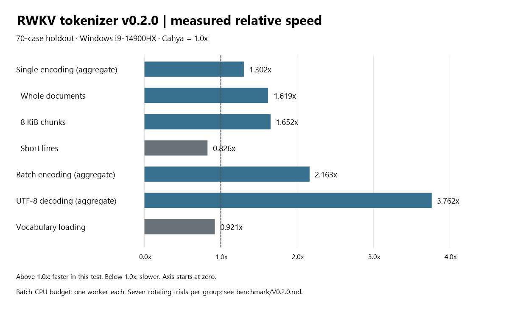

# RWKV7 Rust Tokeniser

A small, pure Rust tokenizer for RWKV models that use the
`rwkv_vocab_v20230424` vocabulary, including compatible RWKV-7 models.
It turns text into token IDs and token IDs back into text, with no runtime
dependencies. The official vocabulary is bundled, so there is nothing extra
to download when your app starts.

This project is free to use and modify under the [Apache-2.0 license](LICENSE),
including in commercial projects. If you find a bug, a useful feature, or a
way to make it faster, issues and pull requests are welcome.

## Getting started

Clone this repository beside your Rust app:

```sh
git clone https://github.com/fleeb83/RWKV7-Rust-Tokeniser.git
```

Then add a local dependency to your app's `Cargo.toml`:

```toml
[dependencies]
rwkv-tokenizer = { path = "../RWKV7-Rust-Tokeniser" }
```

Adjust the path to wherever you cloned the repository. To try the included
example first, run these commands from the tokenizer directory:

```sh
cargo run --example usage --locked
cargo test --locked
```

On Windows, Rust's MSVC toolchain needs Visual Studio C++ Build Tools and a
Windows SDK. Python is only needed for optional
[reference checks and benchmarks](benchmark/README.md).

## Text to tokens and back

Create the tokenizer once when your app loads its model, then reuse it:

```rust
use rwkv_tokenizer::RwkvTokenizer;

let tokenizer = RwkvTokenizer::bundled().expect("valid bundled vocabulary");
let text = "Hello, world! 🦀";
let ids = tokenizer.encode(text).expect("encodable text");

println!("Token IDs: {ids:?}");
assert_eq!(tokenizer.decode_utf8(&ids).unwrap(), text);
```

Pass the IDs to your RWKV runtime for inference, and decode the IDs the model
returns. This crate handles tokenization; model loading, generation and prompt
formatting belong to your chosen runtime.

## Several documents at once

Batch encoding keeps results in the same order as the input documents:

```rust
use rwkv_tokenizer::RwkvTokenizer;

let tokenizer = RwkvTokenizer::bundled().expect("valid bundled vocabulary");
let texts = ["A short note.", "こんにちは", "A second paragraph."];
let batches = tokenizer.encode_batch_auto(&texts).unwrap();

for (text, ids) in texts.iter().zip(&batches) {
    assert_eq!(tokenizer.decode_utf8(ids).unwrap(), *text);
}
```

`encode_batch_auto` chooses a worker count within the shared CPU budget.
You can also call `encode_batch(&texts, 2)` to request an upper bound of two
workers. A batch error reports the first failing document and byte offset.
Cloning a tokenizer shares its immutable vocabulary storage, so you can reuse
it across callers without rebuilding the lookup tables.

## Working with bytes

Use the byte APIs when the input is not necessarily UTF-8:

```rust
use rwkv_tokenizer::RwkvTokenizer;

let tokenizer = RwkvTokenizer::bundled().expect("valid bundled vocabulary");
let bytes = [0x00, 0xff, b'R', b'W', b'K', b'V'];
let ids = tokenizer.encode_bytes(&bytes).unwrap();
assert_eq!(tokenizer.decode_bytes(&ids).unwrap(), bytes);
```

This is also useful during streaming generation: one token can contain only
part of a UTF-8 character. Accumulate decoded bytes until you have complete
UTF-8 before displaying text. Calling `decode_utf8` on an incomplete character
returns an error.

## Handling decoding errors

The checked APIs return errors for unknown token IDs. Token ID `0` is reserved
and has no text entry; handle it as end-of-text in your generation loop before
decoding:

```rust
use rwkv_tokenizer::RwkvTokenizer;

let tokenizer = RwkvTokenizer::bundled().expect("valid bundled vocabulary");
match tokenizer.decode_utf8(&[0]) {
    Ok(text) => println!("{text}"),
    Err(error) => println!("Could not decode: {error}"),
}
assert!(tokenizer.decode_bytes(&[0]).is_err());
```

The examples use `unwrap` for brevity. In an application, propagate errors or
handle them where you can decide what to do with invalid input.

## Vocabulary compatibility

Use this tokenizer with models trained on the RWKV World vocabulary
`rwkv_vocab_v20230424`. It is different from the older `20B_tokenizer.json`.

For a vocabulary file of your own, use
`RwkvTokenizer::from_file(std::path::Path::new("path/to/vocab.txt"))`.
It must follow the supported RWKV World format and token ordering.

## Longest-match selection

Version **0.2.1** pins the greedy matcher's longest-match rule with tests.
Before 0.2.1 the matcher used "higher token ID" as a proxy for "longer token",
which is wrong for a custom vocabulary that numbers a longer token below its
own prefix: with `1 b'abc' 3 / 2 b'ab' 2 / 3 b'a' 1 / 4 b'b' 1 / 5 b'c' 1`,
`encode("abc")` returned `[2, 5]` instead of `[1]`. The matcher now takes the
deepest terminal it reaches regardless of ID. The bundled
`rwkv_vocab_v20230424.txt` never triggered the old behaviour -- all 65,529
entries order every prefix below its extensions -- and a test now checks that
by machine, so bundled-vocabulary output is unchanged.

## Sharing the CPU

Version **0.2.0** adds a cooperative CPU budget shared by independent tokenizer
instances in the same process. The active-worker limit is
`(available_logical_cpus / 32).clamp(1, 8)`, refreshed once per second. On the
32-thread laptop used for testing, that means one active worker. Work quanta
adapt toward 1 ms, with byte budgets between 16 and 256 KiB.

Waiting callers and single-CPU hosts trigger rest periods. The library does
not change process priority or affinity. You can inspect its counters through
`rwkv_tokenizer::cooperation_stats()`.

This is a conservative policy, not a guarantee of zero impact on other apps.
It adapts to reported CPU availability and tokenizer contention, rather than
measuring external system load. Vocabulary construction and full UTF-8
validation use the same gate but are not internally interruptible.

## Benchmarks

These measurements help show where the implementation works well and where
there is room to improve. They are from one Windows i9-14900HX laptop and a
70-case holdout of English text and code from the Canterbury corpus.
Your workload and machine may behave differently.



Cahya is the 1.0x reference: a value above one means less time for the same
work in this test. Batch comparisons use the same one-worker CPU budget for
both implementations, not unrestricted Rayon. Aggregate bars are geometric
means of group medians; the document, chunk and line bars break down the
single-encoding result.

Short lines and vocabulary loading were slower in this holdout. Very small
calls and some large inputs in the separate training screen were also slower.
See the [benchmark summary](benchmark/V0.2.0.md) for exact numbers, methodology,
correctness checks and limitations. Earlier Python comparisons are preserved
in [historical results](benchmark/HISTORICAL.md).

## Contributions

You're welcome to use this as it is, adapt it for your own project, or experiment
with a different approach. If you find an improvement that others could use,
please consider opening a pull request.

For performance changes, a small reproducible example, your machine and Rust
version, and before/after measurements are especially helpful. Please include
correctness checks too: preserving token IDs matters as much as speed. Bug
reports with the input, expected result and actual result are welcome.

## License and acknowledgements

Code is licensed under [Apache-2.0](LICENSE). You may use, modify and redistribute
it under that license; retain the required license and notices when doing so.

The bundled vocabulary is an unmodified copy from BlinkDL/ChatRWKV, also under
Apache-2.0. Its pinned source and SHA-256 are in [NOTICE](NOTICE). Thanks to
BlinkDL and the RWKV community for their work, and to Cahya's tokenizer project
for a useful comparison. Model weights have their own licensing terms.
